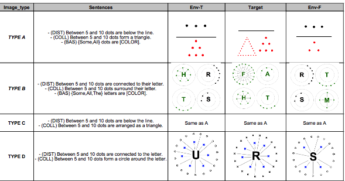

## Design 
####Studies
Condition | Study 1 (CCBC) | Study 2 (DDBD)
----------|------------|-------------
Env-T     | Collective | Distributive
Env-F     | Collective | Distributive
Target 1  | Baseline   | Baseline
Target 2  | Collective | Distributive


*Next studies*

Condition | Study 3 (BBBC) | Study 4 (BBBD)  | Study 5 (CCCD) | Study 6 (CCXD)
----------|----------|----------|------------|-------------
Env-T     | Baseline | Baseline | Collective | Collective
Env-F     | Baseline | Baseline | Collective | Collective
Target 1  | Baseline | Baseline | Collective | X
Target 2  | Collective | Distributive | Distributive |Distributive


####Groups
[link to the google sheet](https://docs.google.com/spreadsheets/d/1ngcopbwjqS_FTYbR3xhqaRAfzc2gM3yry8l5xu-YnVU/edit?usp=sharing)



##Charging everything
####Requiered packages
```{r message=FALSE, warning=FALSE, echo=FALSE}
require(IBEX.to.R)
require(reshape2)
require(plyr)
require(sciplot)
require(ggplot2)
require(grid)
require(lme4)
require(knitr)
require(gdata)
require(data.table)
require(dplyr)

substrRight <- function(x, n){
  substr(x, nchar(x)-n+1, nchar(x))
}
```

####Charging subjects information
```{r message=FALSE, warning=FALSE, echo=FALSE, results='hide'}

pilot1<- c("NonMax_Pilot1_AB","NonMax_Pilot1_BA","NonMax_Pilot1_CD","NonMax_Pilot1_DC")
pilot2<- c("NonMax_Pilot2_AB","NonMax_Pilot2_BA","NonMax_Pilot2_CD","NonMax_Pilot2_DC")

Info <- data.frame(
  subject=character(),
  comment=character(),
  idturk = numeric(),
  language=character(),
  sex = character(),
  year = numeric(),
  group = character(),
  study = character(),
  stringsAsFactors=FALSE)

for (i in 1:length(pilot1))
  {
Info_prov <- get.results(file.path(getwd(), "Pilot-Study1", pilot1[i], "results", "results"),"NewForm", col.names=c("variable","values"))
Info_prov$Col10 <- NULL 
Info_prov$Col11 <- NULL 
Info_prov <- dcast(Info_prov, subject ~ variable, value.var="values")
Info_prov$study <- '1'
Info_prov$group <- substrRight(pilot1[i], 2)
Info_prov$Var.2 <- NULL 
Info <- bind_rows(Info_prov,Info)

Info_prov <- get.results(file.path(getwd(), "Pilot-Study2", pilot2[i], "results", "results"),"NewForm", col.names=c("variable","values"))
Info_prov$Col10 <- NULL 
Info_prov$Col11 <- NULL 
Info_prov <- dcast(Info_prov, subject ~ variable, value.var="values")
Info_prov$study <- '2'
Info_prov$group <- substrRight(pilot2[i], 2)
Info_prov$Var.2 <- NULL 
Info <- bind_rows(Info_prov,Info)
}

Info <- arrange(Info, study)


Bad_subjects <- Info$subject[startsWith(Info$idturk, 'xx', ignore.case=TRUE) | Info$idturk=='Alexandre' ]
  
Info <- subset(Info, !(subject %in% Bad_subjects))


```

####Charging the results
```{r message=FALSE, warning=FALSE, echo=FALSE, results='hide'}

Results<- data.frame(
  subject = factor(),  
  item.number = numeric(), 
  type = character(),     
  sentence = factor(),   
  answer = factor(),    
  nada = factor(),     
  rt = integer(),
  stringsAsFactors=TRUE)
  
for (i in 1:length(pilot1))
  {
  Pilot <- get.results(file.path(getwd(), "Pilot-Study1", pilot1[i], "results", "results"),"SubHtmlFlash", del.col= c(2), col.names=c("sentence","answer","nada","rt"))
  
  Results <- bind_rows(Pilot,Results)
  
      Pilot <- get.results(file.path(getwd(), "Pilot-Study2", pilot2[i], "results", "results"),"SubHtmlFlash", del.col= c(2), col.names=c("sentence","answer","nada","rt"))
  
  Results <- bind_rows(Pilot,Results)
  }


````

####Ordering data
````{r message=FALSE, warning=FALSE, echo=FALSE}

Results$answer <-  as.factor(Results$answer)
Results$subject <-  as.factor(Results$subject)

Results <- select(bind_cols(Results,colsplit(Results$type, "_",names=c("study", "group","condition","truth_value","image_type","predicate_type", "numeral","actual_predicate"))), -c(type,nada))

Results$answer <- mapvalues(Results$answer, from=c('a','r'), to=c("False", "True"))
levels(Results$answer) <- c(0,1)
Results$answer <- as.numeric(as.character(Results$answer))
Results <-filter(Results, Results$study!='practice')

Results$trial_type[startsWith(Results$condition, 'Filler')] <- 'Filler'
Results$trial_type[startsWith(Results$condition, 'E')] <- 'Exp_Item'
Results$trial_type[startsWith(Results$condition, 'T')] <- 'Exp_Item'
Results$log_rt <- log(Results$rt)
Results$condition<-  as.factor(Results$condition)
Results$truth_value<-  as.factor(Results$truth_value)
Results$predicate_type<-  as.factor(Results$predicate_type)
Results$study<-  as.factor(Results$study)
levels(Results$study) <- c("Study 1 (CCBC)", "Study 2 (DDBD)") 

for (i in levels(factor(Results$subject)))
  {Results$item.order[Results$subject == i] <- c(1:96)}

Results <- subset(Results, !(subject %in% Bad_subjects))


Fillers <- filter(Results, Results$trial_type== 'Filler')
Exp_Items <- filter(Results, Results$trial_type=='Exp_Item')

````

## Exploratory data 
#### *Information on my data*
```{r, tidy=TRUE, highlight=TRUE, collapse=TRUE}
kable(table(Info$study,Info$group),caption='Number of subjects per group')
#kable(table(Results$study,Results$group))
#str(Results) 
```

#### Checking everything...
````{r results='hide', eval=FALSE, echo=FALSE}
#are items randomized?
plot(Results$item.number,Results$item.order , col=Results$subject)

#are number of items per condition ok?
kable(arrange(aggregate(sentence~study+group+condition, data=aggregate(sentence~group+condition+study+subject, data= Results, length), mean),group))

````

###Exploring distribution and subject variability
```{r echo=FALSE, fig.align='center', fig.width=10}
plot1 <- ggplot(Results, aes(x=answer, colour=truth_value)) + geom_density()
plot1 + facet_grid(study ~ group)

Subj_Variability <- arrange(aggregate(answer~subject+truth_value+study+group, data= Results ,mean, na.rm=T), group)

````

####**plotting** variability
*Each line corresponds to a subject in the three different expected truth-values (Fillers and Experimental items are aggregated; Target == Target2)* 
<font color="purple"> Note: The two different patterns of results (specially in Study 1) might be related with the differences between image-predicate pairs (we are aggregating by group here) </font> 

````{r echo=FALSE, fig.align='center'}
plot2 <- ggplot(Subj_Variability, aes(x=truth_value, y=answer, color=subject,  group=subject)) +
    geom_line() +
    geom_point()
plot2 + facet_grid(study ~ .) + theme(legend.position="none")
```


###Exploring RT
```{r, fig.align='center', echo=FALSE}
summary(Results$rt)
plot(Results$log_rt, col=Results$subject)
```

### Exclusion criteria
1. Not English speakers
2. RT +/- 2 sd from mean
3. - of 85 correct in fillers
````{r echo=FALSE}
rt_per_subject <- aggregate(rt~subject, data=Results, mean, na.rm=T)
````
**All subjects were accurate. Some trials were pretty slow but I didn't take them out because we don't have many subjects and they didn't change the tendency**


### Fillers analysis
Are people paying attention?
```{r echo=FALSE, results='hide'}
Subj_Fillers <- arrange(aggregate(answer~subject+condition+truth_value+study+group, data= Fillers, mean, na.rm=T),subject)

All_Fillers <- ddply(Subj_Fillers, c("truth_value", "study","group"),
            function(All_Fillers)c(response=mean(All_Fillers$answer, na.rm=T), se=se(All_Fillers$answer, na.rm=T)))

kable(All_Fillers, long.table=TRUE)
````


#### **plotting** Fillers in bars
````{r echo=FALSE, fig.align='center'}
plot3 <- ggplot(All_Fillers, aes(x=truth_value, y=response, fill=truth_value)) +
      geom_bar(position=position_dodge(), stat="identity") +
      ggtitle("Filler responses")+ 
      scale_fill_brewer(palette="Dark2")+  
      xlab('Expected truth value')  +
      ylab('Mean TRUE responses')  +
      geom_errorbar(aes(ymin=response-se, ymax=response+se), width=.2, position=position_dodge(.9))

plot3 +facet_grid(study ~ group) + theme(plot.title = element_text(size = rel(1.6), face='bold', family="Tahoma", vjust=1.5), legend.background = element_rect(colour = "black"), axis.text.x=element_text(size=12, vjust=0.5), axis.text.y=element_text(size=12, vjust=0.5), axis.title.y = element_text(size=14, vjust=0.5), axis.title.x = element_text(size=14, vjust=.3), legend.title = element_text(size=12, face="bold"), legend.text = element_text(size = 12), legend.position="top")

```

***


## Experimental items analysis

> Questions

1. Within Study 1 
+ Does collective predicates give rise to non-maximal readings? Study 1: **Target2 vs. Env-F**
+ What is the relation between maximal and non-maximal readings? Study 1: **Target2 vs. Env-T**

2. Within Study 2
+ How unlikely are non-maximal readings for distributive predicates?  Study 2: **Target2 vs. Env-T**  
+ Are there phantom non-maximal readings for distributive predicates? (Replication of Marty et al. 2014 results) **Target2 vs. Env-F**

3. Are there fewer non-maximal readings for distributive than for collective predicates?
**Interaction between Studies 1 and 2**

***

### 1. Response rate: Study X Condition
*Collapsing all the groups of subjects


> Aggregate data

````{r echo=FALSE}
Subj_Targets_2 <- arrange(aggregate(answer~subject+condition+study, data= Exp_Items, mean, na.rm=T),condition)

All_Targets_2 <- ddply(Subj_Targets_2, c("condition", "study"),
            function(All_Targets_2 )c(response=mean(All_Targets_2$answer, na.rm=T), se=se(All_Targets_2$answer, na.rm=T)))

kable(All_Targets_2, align='c', longtable=TRUE, digits=2)

````

***
> *plotting*

Note: Target 1 = Baseline (50/50 of True/False)


````{r echo=FALSE,fig.width=5, fig.height=5,fig.align='center'}
plot4 <- ggplot(All_Targets_2, aes(x=condition, y=response, fill=condition)) +     geom_bar(position=position_dodge(), stat="identity") +
      ggtitle("Target responses")+ 
      scale_fill_manual(values=c("#CC6666", "#9999CC", "#66CC99", "#FF9933"))+  
      xlab('Condition')  +
      ylab('Mean TRUE responses')  +
      geom_errorbar(aes(ymin=response-se, ymax=response+se), width=.2, position=position_dodge(.9))

plot4 +facet_grid(study ~ .) + theme(plot.title = element_text(size = rel(1.6), face='bold', family="Tahoma", vjust=1.5), legend.background = element_rect(colour = "black"), axis.text.x=element_text(size=12, vjust=0.5), axis.text.y=element_text(size=12, vjust=0.5), axis.title.y = element_text(size=14, vjust=0.5), axis.title.x = element_text(size=14, vjust=.3), legend.title = element_text(size=12, face="bold"), legend.text = element_text(size = 12), legend.position="top")
```

seen in another way....

````{r echo=FALSE,fig.width=10, fig.height=5,fig.align='center'}
plot4bis <- ggplot(All_Targets_2, aes(x=study, y=response, fill=study)) +     geom_bar(position=position_dodge(), stat="identity") +
      ggtitle("Target responses")+ 
       xlab('study')  +
      ylab('Mean TRUE responses')  +
      geom_errorbar(aes(ymin=response-se, ymax=response+se), width=.2, position=position_dodge(.9))

plot4bis +facet_grid(. ~ condition) + theme(plot.title = element_text(size = rel(1.6), face='bold', family="Tahoma", vjust=1.5), legend.background = element_rect(colour = "black"), axis.text.x=element_blank(), axis.text.y=element_text(size=12, vjust=0.5), axis.title.y = element_text(size=14, vjust=0.5), axis.title.x = element_text(size=14, vjust=.3), legend.title = element_text(size=12, face="bold"), legend.text = element_text(size = 12), legend.position="top")
````

***
> Differences only for Target2

```{r echo=FALSE}
Target2 <- filter(Results, Results$condition=='Target2')
Subj_Targets <- arrange(aggregate(answer~subject+study+group, data= Target2, mean, na.rm=T),group)

All_Groups<- ddply(Subj_Targets, c("study","group"),
            function(All_Groups)c(response=mean(All_Groups$answer, na.rm=T), se=se(All_Groups$answer, na.rm=T)))
```


> Trials with image_type A and C have the same image but different predicate (form a square vs. arranged as a square)


````{r echo=FALSE,fig.width=5, fig.height=4,fig.align='center'}
plot6 <- ggplot(All_Groups, aes(x=study, y=response, fill=group)) + geom_bar(position=position_dodge(), stat="identity") +
      ggtitle("True responses for Target 2")+ 
      scale_fill_brewer(palette="Set1", labels=c('B','A','D','C'), name='Image x predicate type') +  
      xlab('study')  +
      ylab('Mean TRUE responses')  +
      geom_errorbar(aes(ymin=response-se, ymax=response+se), width=.2, position=position_dodge(.9))

plot6 + theme(plot.title = element_text(size = rel(1.6), face='bold', family="Tahoma", vjust=1.5), legend.background = element_rect(colour = "black"), axis.text.x=element_text(size=12, vjust=0.5), axis.text.y=element_text(size=12, vjust=0.5), axis.title.y = element_text(size=12, vjust=0.5), axis.title.x = element_text(size=12, vjust=.3), legend.title = element_text(size=12, face="bold"), legend.text = element_text(size = 12), legend.position="top")

```

predicate |A | B | C | D
----|--|---|---|---
collective|form a square/triangle|surround their letter|arranged as a square/triangle | form a circle around the letter
distributive| are above/below the letter | are connected to their letter | are above/below the letter | are connected to the letter | 


###Stats
*Global model*
```{r results='hide', eval=FALSE}
#I am taking out Target 1 because they are Baselines
mydata <- subset(Exp_Items, condition!='Target1') 

#coding the interactions as factors
mydata$interaction<-contrasts(mydata$condition)[mydata$condition]*
contrasts(mydata$study)[mydata$study]

#### main model
m1 <- glmer(answer~condition+study+interaction+(1+condition|subject), mydata, family=binomial)
summary(m1)

#NOTE: I am not sure here how to code groups (I have to?) 

```

*1. Main effect of condition in BOTH experiments*
```{r results='hide', eval=FALSE}
m0 <- glmer(answer~study+interaction+(1+condition|subject), mydata, family=binomial)
summary(anova(m1,m0))

```

*2. Main effect of  experiments*
```{r results='hide', eval=FALSE}
m0 <- glmer(answer~condition+interaction+(1+condition|subject), mydata, family=binomial)
summary(anova(m1,m0))

```

*3. Interaction*
```{r results='hide', eval=FALSE}
m0 <- glmer(answer~condition+study+(1+condition|subject), mydata, family=binomial)
summary(anova(m1,m0))
```

*4. effect of Group?*
Not sure about this-
```{r results='hide', eval=FALSE}
m1 <- glmer(answer~condition+study+group+interaction+(1+condition|subject), mydata, family=binomial)
m0 <- glmer(answer~condition+study+interaction+(1+condition|subject), mydata, family=binomial)
summary(anova(m1,m0))
```


**If there is an interaction, I repeat step (1) for each experiment.** 

### 2. Response rate:  Study X Group X Condition
*Checking for effects of the group (~image)*

***
> Aggregate data

````{r echo=FALSE, results='hide'}
Subj_Targets_1 <- arrange(aggregate(answer~subject+condition+study+group, data= Exp_Items, mean, na.rm=T),condition)

All_Targets_1 <- ddply(Subj_Targets_1, c("condition", "study","group"),
            function(All_Targets_1 )c(response=mean(All_Targets_1 $answer, na.rm=T), se=se(All_Targets_1 $answer, na.rm=T)))

All_Targets_1 <- filter(All_Targets_1, All_Targets_1$condition != 'Target1'  )
kable(All_Targets_1, align='c', longtable=TRUE, digits=2)

````

***
> *plotting*

````{r echo=FALSE,fig.width=10, fig.height=5, fig.align='center'}
plot5 <- ggplot(All_Targets_1, aes(x=condition, y=response, fill=condition)) +     geom_bar(position=position_dodge(), stat="identity") +
      ggtitle("Responses in Exp-items * Group")+ 
      scale_fill_manual(values=c("#CC6666", "#9999CC", "#FF9933"))+
      xlab('Condition')  +
      ylab('Mean TRUE responses')  +
      geom_errorbar(aes(ymin=response-se, ymax=response+se), width=.2, position=position_dodge(.9))

plot5 +facet_grid(study ~ group) + theme(plot.title = element_text(size = rel(1.6), face='bold', family="Tahoma", vjust=1.5), legend.background = element_rect(colour = "black"), axis.text.x=element_text(size=12, vjust=0.5), axis.text.y=element_text(size=12, vjust=0.5), axis.title.y = element_text(size=14, vjust=0.5), axis.title.x = element_text(size=14, vjust=.3), legend.title = element_text(size=12, face="bold"), legend.text = element_text(size = 12), legend.position="top")

```


### 3. Response times: Study X Condition

***
> Aggregate data

````{r echo=FALSE, results='hide'}
Subj_RT_1 <- arrange(aggregate(log_rt~subject+condition+study, data= Exp_Items, mean, na.rm=T),condition)

All_RT_1 <- ddply(Subj_RT_1, c("condition", "study"),
            function(All_RT_1)c(response=mean(All_RT_1 $log_rt, na.rm=T), se=se(All_RT_1$log_rt, na.rm=T)))

All_RT_1 <- filter(All_RT_1, All_RT_1$condition != 'Target1')
kable(All_RT_1, align='c', longtable=TRUE, digits=2)

````

***
> *plotting*

````{r echo=FALSE,fig.width=5, fig.height=5,fig.align='center'}
plot7 <- ggplot(All_RT_1, aes(x=condition, y=response, fill=condition)) +     geom_bar(position=position_dodge(), stat="identity") +
      ggtitle("RTs in Exp items")+ 
      scale_fill_manual(values=c("#CC6666", "#9999CC", "#FF9933"))+   
      xlab('Condition')  +
      ylab('Mean log rt')  +
  coord_cartesian(ylim=c(7, 8.5)) + 
      geom_errorbar(aes(ymin=response-se, ymax=response+se), width=.2, position=position_dodge(.9))

plot7 +facet_grid(study ~ .) + theme(panel.margin = unit(1, "lines"), plot.title = element_text(size = rel(1.6), face='bold', family="Tahoma", vjust=1.5), legend.background = element_rect(colour = "black"), axis.text.x=element_text(size=12, vjust=0.5), axis.text.y=element_text(size=12, vjust=0.5), axis.title.y = element_text(size=14, vjust=0.5), axis.title.x = element_text(size=14, vjust=.3), legend.title = element_text(size=12, face="bold"), legend.text = element_text(size = 12), legend.position="top")
```


##### Only TRUE cases

````{r echo=FALSE, results='hide'}
True <- subset(Exp_Items, Exp_Items$answer==1)
Subj_RT_1 <- arrange(aggregate(log_rt~subject+condition+study, data= True, mean, na.rm=T),condition)

All_RT_1 <- ddply(Subj_RT_1, c("condition", "study"),
            function(All_RT_1)c(response=mean(All_RT_1 $log_rt, na.rm=T), se=se(All_RT_1$log_rt, na.rm=T)))

All_RT_1 <- filter(All_RT_1, All_RT_1$condition != 'Target1' & All_RT_1$condition != 'Env-F')
kable(All_RT_1, align='c', longtable=TRUE, digits=2)

````

````{r echo=FALSE,fig.width=6, fig.height=4,fig.align='center'}
plot7_bis <- ggplot(All_RT_1, aes(x=study, y=response, fill=study)) +     geom_bar(position=position_dodge(), stat="identity") +
      ggtitle("RTs in Exp items (only TRUE cases)")+ 
      xlab('study')  +
      scale_fill_manual(values=c("#9999CC", "#FF9933"))+ 
      coord_cartesian(ylim=c(7, 8.5)) + 
      ylab('Mean log rt')  +
      geom_errorbar(aes(ymin=response-se, ymax=response+se), width=.2, position=position_dodge(.9))

plot7_bis +facet_grid(. ~ condition) + theme(panel.margin = unit(1, "lines"), plot.title = element_text(size = rel(1.6), face='bold', family="Tahoma", vjust=1.5), legend.background = element_rect(colour = "black"), axis.text.x=element_text(size=12, vjust=0.5), axis.text.y=element_text(size=12, vjust=0.5), axis.title.y = element_text(size=14, vjust=0.5), axis.title.x = element_text(size=14, vjust=.3), legend.title = element_text(size=12, face="bold"), legend.text = element_text(size = 12), legend.position="top")
```

### 4. Response times: Study X Condition X Group

***
> Aggregate data


I am taking out Target1 because the type of sentence is different. 
````{r echo=FALSE, results='hide'}
Subj_RT_2 <- arrange(aggregate(log_rt~subject+condition+study+group, data= Exp_Items, mean, na.rm=T),condition)

All_RT_2 <- ddply(Subj_RT_2, c("condition", "study", "group"),
            function(All_RT_2)c(response=mean(All_RT_2$log_rt, na.rm=T), se=se(All_RT_2$log_rt, na.rm=T)))

All_RT_2 <- filter(All_RT_2, All_RT_2$condition != 'Target1')
kable(All_RT_2, align='c', longtable=TRUE, digits=2)

````

***
> *plotting*

````{r echo=FALSE,fig.width=9, fig.height=5,fig.align='center'}
plot8 <- ggplot(All_RT_2, aes(x=condition, y=response, fill=condition)) +     geom_bar(position=position_dodge(), stat="identity") +
      ggtitle("RTs x Group in Exp items")+ 
     scale_fill_manual(values=c("#CC6666", "#9999CC", "#FF9933"))+ 
      xlab('Condition')  +
      ylab('Mean log rt')  +
    coord_cartesian(ylim=c(7, 8.5)) + 
      geom_errorbar(aes(ymin=response-se, ymax=response+se), width=.2, position=position_dodge(.9))

plot8 +facet_grid(study ~ group) + theme(panel.margin = unit(1, "lines"), plot.title = element_text(size = rel(1.6), face='bold', family="Tahoma", vjust=1.5), legend.background = element_rect(colour = "black"), axis.text.x=element_text(size=12, vjust=0.5), axis.text.y=element_text(size=12, vjust=0.5), axis.title.y = element_text(size=14, vjust=0.5), axis.title.x = element_text(size=14, vjust=.3), legend.title = element_text(size=12, face="bold"), legend.text = element_text(size = 12), legend.position="top")
```


##### Only TRUE cases
````{r echo=FALSE, results='hide'}

Subj_RT_2 <- arrange(aggregate(log_rt~subject+condition+study+group, data= True, mean, na.rm=T),condition)

All_RT_2 <- ddply(Subj_RT_2, c("condition", "study", "group"),
            function(All_RT_2)c(response=mean(All_RT_2$log_rt, na.rm=T), se=se(All_RT_2$log_rt, na.rm=T)))

All_RT_2 <- filter(All_RT_2, All_RT_2$condition != 'Target1' & All_RT_2$condition != 'Env-F')
kable(All_RT_2, align='c', longtable=TRUE, digits=2)

````

````{r echo=FALSE,fig.width=9, fig.height=5,fig.align='center'}
plot8bis <- ggplot(All_RT_2, aes(x=condition, y=response, fill=condition)) +     geom_bar(position=position_dodge(), stat="identity") +
      ggtitle("RTs x Group in Exp items (only True cases)")+ 
      scale_fill_manual(values=c( "#9999CC", "#FF9933"))+ 
      xlab('Condition')  +
      ylab('Mean log rt')  +
    coord_cartesian(ylim=c(7, 8.5)) + 
      geom_errorbar(aes(ymin=response-se, ymax=response+se), width=.2, position=position_dodge(.9))

plot8bis +facet_grid(study ~ group) + theme(panel.margin = unit(1, "lines"), plot.title = element_text(size = rel(1.6), face='bold', family="Tahoma", vjust=1.5), legend.background = element_rect(colour = "black"), axis.text.x=element_text(size=12, vjust=0.5), axis.text.y=element_text(size=12, vjust=0.5), axis.title.y = element_text(size=14, vjust=0.5), axis.title.x = element_text(size=14, vjust=.3), legend.title = element_text(size=12, face="bold"), legend.text = element_text(size = 12), legend.position="top")
```


###Stats
*Global model*
```{r results='hide', eval=FALSE}
#I am taking out Target 1 because they are Baselines
mydata <- subset(Exp_Items, condition!='Target1') 

#coding the interactions as factors
mydata$interaction<-contrasts(mydata$condition)[mydata$condition]*
contrasts(mydata$study)[mydata$study]

#### main model
m1 <- lmer(log_rt~condition+study+interaction+(1+condition|subject), mydata, REML=FALSE)
summary(m1)

#NOTE: I am not sure here how to code groups (I have to?) 

```

*1. Main effect of condition in BOTH experiments*
```{r results='hide', eval=FALSE}
m0 <-  lmer(log_rt~study+interaction+(1+condition|subject), mydata, REML=FALSE)
summary(anova(m1,m0))

```

*2. Main effect of  experiments*
```{r results='hide', eval=FALSE}
m0 <-  lmer(log_rt~condition+interaction+(1+condition|subject), mydata, REML=FALSE)
summary(anova(m1,m0))

```

*3. Interaction*
```{r results='hide', eval=FALSE}
m0 <-  lmer(log_rt~condition+study+(1+condition|subject), mydata, REML=FALSE)
summary(anova(m1,m0))
```

**If there is an interaction, I repeat step (1) for each experiment.** 

